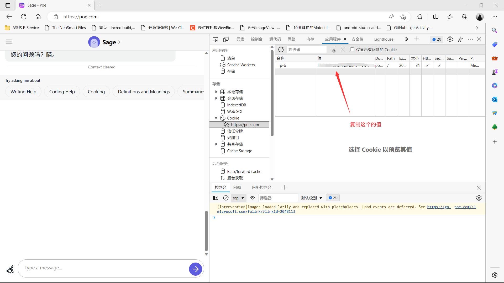

## koishi-plugin-chathub-poe-adapter

##  

> 为 ChatHub 提供 [poe.com](https://poe.com) 支持的适配器

## 怎么使用？

1. 在插件市场安装本插件(`@dingyi222666/chathub-poe-adapter`)，并安装好本插件依赖的前置插件
2. 获取到 Poe 账号的 Cookie 里的`p-b`的值。这里介绍一下怎么用 Chrome 获取这个值

    1.登录到 poe.com

    2.打开开发者工具，选择 Application

    3.在左侧选择 Cookie，找到 poe.com 的 Cookie，复制 p-b 的值

    如图所示：

    

3. 在插件的设置中填写你的p-b的值（请求设置 -> cookie）

4. 国内环境需要设置代理，推荐在`chathub`主插件里设置里设置代理(请求设置 -> isProxy，请求设置 -> proxyAddress)

5. 如果想默认使用 Poe 的话，需要使用命令设置为默认的适配器。

6. 现在你可以尝试回复 Bot 一句你好，如果 Bot 响应了你，那么恭喜你，你已经成功接入了 Poe。

## 常见问题

### 目前使用这个插件会对账号有风险吗？

在上游反编译 API 里，有人遇到了这样的[问题（账号被封）](https://github.com/ading2210/poe-api/issues/54)，我不能保证使用此插件后你的账号不会被封，请谨慎使用此插件。
